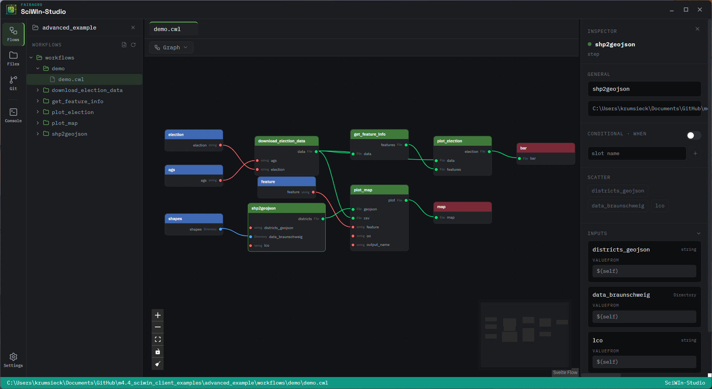

<p align="center">
  
</p>

# SciWIn Studio<!-- omit from toc -->

[](https://github.com/fairagro/sciwin_studio/actions/workflows/ci.yml)
[](https://github.com/fairagro/sciwin_studio/actions/workflows/release.yml)
[](https://github.com/fairagro/sciwin_studio/releases)


**SciWIn Studio** is the graphical desktop companion to [**SciWIn-Client**](https://github.com/fairagro/sciwin) (`s4n`), the FAIRagro Scientific Workflow Infrastructure. It gives researchers a visual way to build, inspect, and run reproducible [Common Workflow Language (CWL)](https://www.commonwl.org/) workflows, without needing to touch a terminal.

> [!NOTE]
> SciWIn Studio is currently in beta. Features and functionality may still change as development progresses.

<p align="center">
  
</p>

## Table of Contents<!-- omit from toc -->
- [About](#about)
- [Features](#features)
- [Installation](#installation)
- [Development](#development)
- [Ecosystem](#ecosystem)
- [Contributors](#contributors)
- [License](#license)

## About
Computational workflows make complex, multi-step analyses reproducible, scalable, and shareable, but authoring and running them by hand is tedious and error-prone. SciWIn Studio is a [Tauri](https://tauri.app/) desktop application, a Rust backend paired with a [SvelteKit](https://kit.svelte.dev/)/Svelte 5 frontend, that wraps the [`sciwin`](https://github.com/fairagro/sciwin) crate, so that creating CWL `CommandLineTool`s and `Workflow`s, wiring them together, and executing them is possible without ever leaving a graphical interface.

Every SciWIn Studio project is a `sciwin`/`s4n` project on disk (a `workflow.toml` plus a git repository), so projects created or edited in the GUI stay fully compatible with the `s4n` CLI and vice versa.

## Features
- **Visual workflow design** — arrange CWL tools on a canvas and connect their inputs and outputs with drag-and-drop, powered by [`@xyflow/svelte`](https://svelteflow.dev/)
- **Tool authoring** — generate new CWL `CommandLineTool`s from a command, container image, and arguments through a guided form
- **Built-in code editor** — inspect and edit the underlying CWL YAML with a [Monaco](https://microsoft.github.io/monaco-editor/)-powered editor, with language features (diagnostics, completion) served by an in-process `cwl-lsp` server
- **Git-backed projects** — every change is staged and committed automatically, so a project's history is always a working, versioned record
- **Workflow execution** — run workflows locally or remotely against a [REANA](https://reanahub.io/) instance, with credentials stored in the OS keychain and live execution logs in an in-app terminal

## Installation
Tagged releases are built for Windows, macOS (Intel and Apple Silicon), and Linux and published as [GitHub Releases](https://github.com/fairagro/sciwin_studio/releases) by [`.github/workflows/release.yml`](.github/workflows/release.yml).

## Development
SciWIn Studio is built with [Tauri v2](https://tauri.app/). To run it in development mode you need [Node.js](https://nodejs.org/) 22+, a recent Rust toolchain, and the native GTK/WebKit dependencies used by Tauri's desktop renderer.

On Debian/Ubuntu:
```bash
# Install native dependencies
sudo apt-get update
sudo apt-get install -y \
    libgtk-3-dev \
    libglib2.0-dev \
    libwebkit2gtk-4.1-dev \
    build-essential \
    curl \
    wget \
    file \
    libxdo-dev \
    libssl-dev \
    libayatana-appindicator3-dev \
    librsvg2-dev

# Install frontend dependencies
npm install

# Launch SciWIn Studio in dev mode (backend + frontend, hot reload)
npx tauri dev
```

For macOS and Windows, follow the platform-specific prerequisites in the [Tauri getting started guide](https://tauri.app/start/prerequisites/).

Production bundles are produced with `npx tauri build`. Tagged releases (`v*.*.*`) are built and published automatically for all platforms via [`tauri-apps/tauri-action`](https://github.com/tauri-apps/tauri-action) (see `.github/workflows/release.yml`).

## Ecosystem
SciWIn Studio depends on the [`sciwin`](https://crates.io/crates/sciwin) and [`commonwl`](https://crates.io/crates/commonwl) crates (including `cwl-lsp`, `commonwl`'s bundled CWL language server) from the main [SciWIn-Client](https://github.com/fairagro/sciwin) repository for project management, CWL parsing, and execution. Read the [SciWIn-Client documentation](https://fairagro.github.io/sciwin/) to learn more about the underlying CLI, project layout, and CWL concepts shared by both tools.

## Contributors
<a href="https://github.com/fairagro/sciwin_studio/graphs/contributors">
  
</a>

<small>Made with [contrib.rocks](https://contrib.rocks).</small>

|[Measure 4.4](https://fairagro.net/tag/measure-4-4/)|||
|--|--|--|
|Jens Krumsieck|[:octocat: @jenskrumsieck](https://github.com/JensKrumsieck)|[ORCID: 0000-0001-6242-5846](https://orcid.org/0000-0001-6242-5846)|
|Antonia Leidel|[:octocat: @aleidel](https://github.com/aleidel)|[ORCID: 0009-0007-1765-0527](https://orcid.org/0009-0007-1765-0527)|
|Patrick König|[:octocat: @patrick-koenig](https://github.com/patrick-koenig)|[ORCID: 0000-0002-8948-6793](https://orcid.org/0000-0002-8948-6793)|
|Xaver Stiensmeier|[:octocat: @XaverStiensmeier](https://github.com/XaverStiensmeier)|[ORCID: 0009-0005-3274-122X](https://orcid.org/0009-0005-3274-122X)|
|Harald von Waldow|[:octocat: @hvwaldow](https://github.com/hvwaldow)|[ORCID: 0000-0003-4800-2833](https://orcid.org/0000-0003-4800-2833)|

## License
This work is dual-licensed under Apache 2.0 and MIT. You can choose between one of them if you use this work.

`SPDX-License-Identifier: Apache-2.0 OR MIT`
